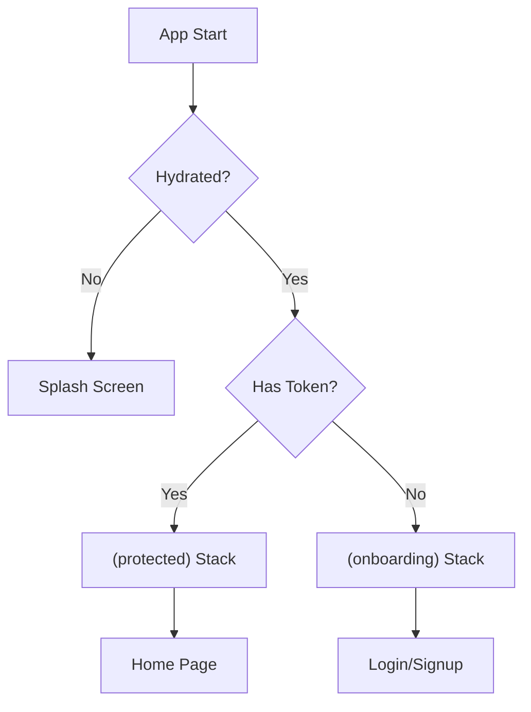

# Khumbaya Auth Architecture: Zustand + TanStack Query

This document explains the full authentication and data synchronization flow in the application.

## High-Level Architecture

The app uses a 3-layer state management system:
1.  **Zustand (Client Store)**: Manages persistence (Tokens) and global settings.
2.  **TanStack Query (Server Store)**: Manages API data, caching, and loading states.
3.  **Expo Router (Redirection Logic)**: Manages "Protected Routes" based on the presence of a token.

---

## 1. The Core Components

### `AuthStore.ts` (Zustand)
This is the "Source of Truth" for the authentication.
- **`token`**: The JWT token used for API requests.
- **`user`**: Basic user info (ID, name, email).
- **`hydrate()`**: Loads the token from `SecureStore` when the app starts.

### `_layout.tsx` (The Guard)
This file controls which screens the user can see.


### `axios.ts` (The Interceptor)
Automatically connects the Store to the Network.
- **Request**: Inject `Authorization: Bearer <token>` into every request.
- **Response**: If the server returns **401 (Unauthorized)**, it calls `clearAuth()`, which resets the Zustand `token` to `null`.

---

## 2. Typical Data Flows

### A. Login Flow (Mutation)
1.  **UI**: User enters credentials.
2.  **`useMutation`**: Calls the API via Axios.
3.  **`onSuccess`**: 
    -   API returns a token.
    -   Calls `setAuth(token, user)`.
    -   `_layout.tsx` detects the new token and **automatically** redirects to Protected Home.

### B. Fetching Data (Query)
1.  **UI**: Component mounts (e.g., Profile Screen).
2.  **`useQuery`**: Checks cache. If stale, hits the API with the token from Zustand.
3.  **Result**: Returns `data`, `isLoading`, and `error` directly to the component.

---

## 3. Navigation Redirection Logic

We use a "Navigation Guard" inside `app/_layout.tsx` to prevent users from getting lost when the Auth state changes.

```typescript
useEffect(() => {
  if (isLoading) return; // Wait for hydration

  const inAuthGroup = segments[0] === "(onboarding)";

  if (token && inAuthGroup) {
    // Just logged in -> jump to home
    router.replace("/(protected)/(client-tabs)/home");
  } else if (!token && !inAuthGroup) {
    // Just logged out (or session expired) -> kick to login
    router.replace("/(onboarding)");
  }
}, [token, isLoading, segments]);
```

---

## 4. Why this is "Production-Gray"
- **No Flickering**: The splash screen stays up until the token is verified.
- **Secure**: Sensitive tokens are in `SecureStore`, not plain `AsyncStorage`.
- **Automatic**: Logouts happen automatically when tokens expire (via interceptors).
- **Type Safe**: Everything is defined in TypeScript.

## 5. Directory Mapping
- **Context/Store**: `src/store/AuthStore.ts`
- **Network**: `src/api/axios.ts`
- **Hooks**: `src/features/*/api/use-*.ts`
- **Entry Points**: `app/_layout.tsx` & `app/index.tsx`
- **Config**: `src/config/env.ts`

---

## 6. Development Bypass (Debug Auto-Login)

For faster development and testing, you can bypass the login screen.

### Configuration (`src/config/env.ts`)
- **`DEBUG_AUTO_LOGIN`**: Set to `true` to enable bypass. It automatically checks `__DEV__` to ensure it never runs in production.
- **`TEST_USER`**: Define the dummy token and user info here.

### How it Works
During the `hydrate()` process in `AuthStore.ts`, if no real session exists and the debug flag is active, the stores are prepopulated with the `TEST_USER` data. The `_layout.tsx` guard then sees the token and immediately redirects to the dashboard.
